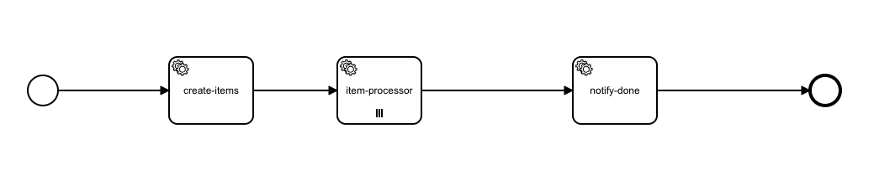
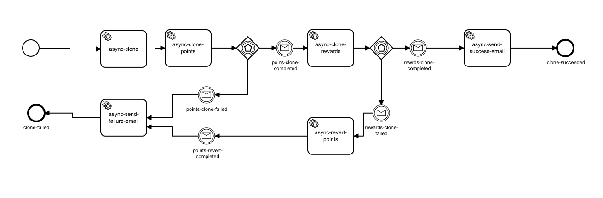
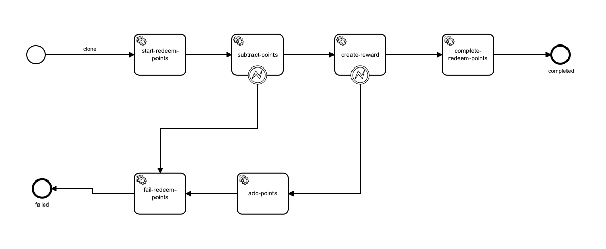

# Orchestrate Microservices By A Spring Boot Worker

This project contains a worker that can connect a BPMN service task to whatever you need to.

Requirements:

* Java >= 8
* Maven

How to run:

* Download/clone the code in this folder.
* You need to set your Camunda cloud client connection details in the file `application.properties`. Simply replace the existing sample values.
* Run the application:

Now you need to  deploy BPMN files (under resources/processes) to camunda modeler.

## Batch Items
Demonstrates batch job.  

'create-items' task receives 'count' variable and creates items collection as an output.
'item-processor' task receives a single item and prints it.
once all items are processed 'notify-done' tasks prints the number of total items count.

How to run:
- Deploy the [batch.bpmn](src/main/resources/processes/batch-items.bpmn) to camunda cloud modeler
- Start Instance with json variable: {"count":100}
- Set proper zeebe.client.cloud.clientSecret in [application.properties](src/main/resources/application.properties)
- Run [BatchItems](src/main/java/victor/prp/cammunda/poc/batch/BatchItems.java) using your IDE or maven

## Clone Config Async
Demonstrates classic SAGA with compensation operations.  

Each participant (points and rewards services) asynchronously perform clone operation and notify when done.
Finally, success or failure email is sent.
In case of any failure corresponding compensations are executed.

How to run:
- Deploy the [clone-config-async.bpmn](src/main/resources/processes/clone-config-async.bpmn) to camunda cloud modeler
- Start Instance (without parameters)
- Set proper zeebe.client.cloud.clientSecret in [application.properties](src/main/resources/application.properties)
- Run [CloneConfigAsync](src/main/java/victor/prp/cammunda/poc/async/CloneConfigAsync.java) using your IDE or maven

NOTE: In order to force rewards step fair Start the Instance with the following variables:
{
    "fail-rewards":"true"
}

## Redeem Points Sync
Demonstrates synchronous SAGA with compensation operations. 

In this scenario a customer redeems his points and gets corresponding reward.
The given rewardId should be returned if the flow succeeded (should be implemented asynchronously)
The operation is exposed via REST end point: POST /redeem-points. 

It also shows how reactive programming can be used with Camunda via ZeebeClient.

NOTES:
- In the real world scenario the REST response should provide a reference to redemption entity (URL) so the client can poll its state
- In order to optimize client side websocket can be used (in this case we should consider impl camunda process exporter)

How to run:
- Deploy the [redeem-points-sync.bpmn](src/main/resources/processes/redeem-points-sync.bpmn) to camunda cloud modeler
- Set proper zeebe.client.cloud.clientSecret in [application.properties](src/main/resources/application.properties)
- Run [CloneConfigAsync](src/main/java/victor/prp/cammunda/poc/sync) using your IDE or maven
- Use postman and call POST http://localhost:8084/redeem-points {}

NOTE: In order to force rewards step fail, add the following body when calling the REST:
{
    "fail-rewards":"true"
}